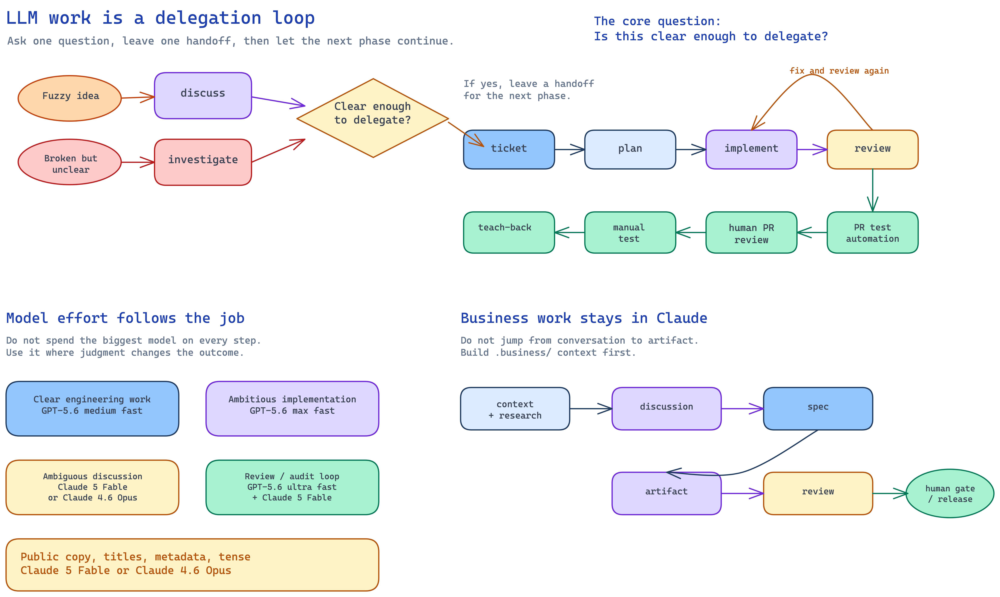
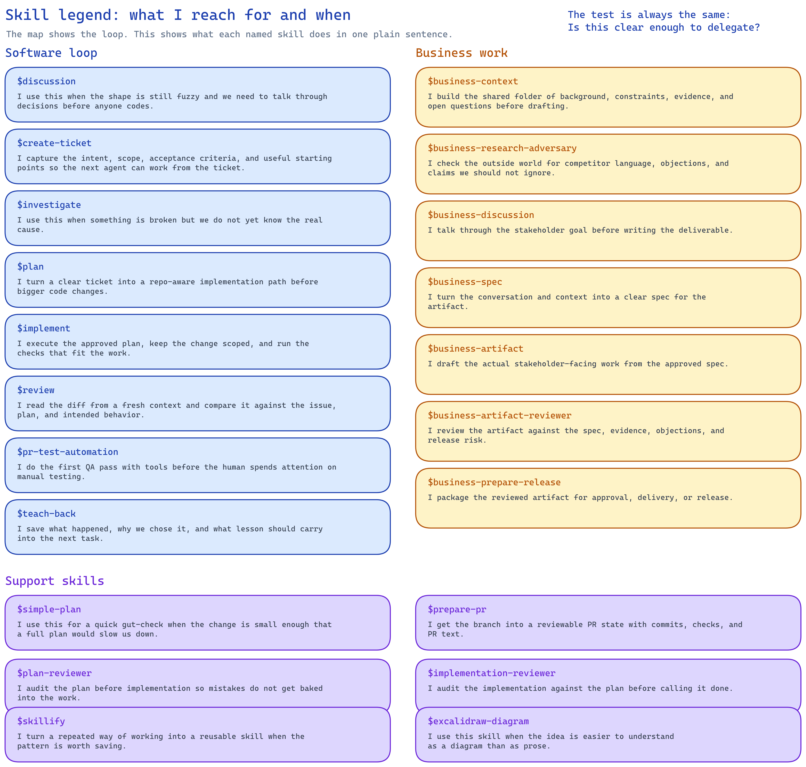
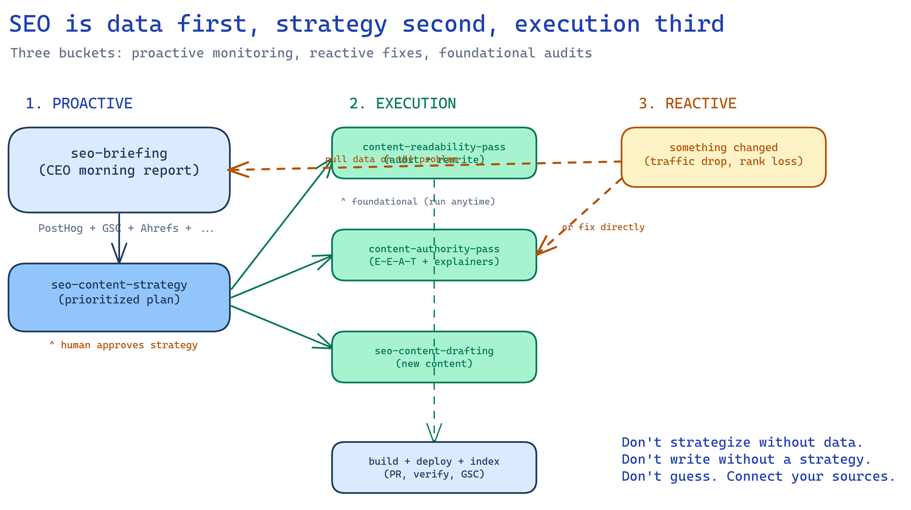

# skills

This repo keeps the LLM workflows we actually use on the Pane team.

The goal is simple: make good work easier to delegate, review, test, and learn
from. These skills help with the moments that repeat: fuzzy ideas, ticket
capture, planning, implementation, review, PR testing, and learning from the
work.

Start in `parsa/` for the current version of the workflow.

Here is the whole workflow as a map:



_Source: [docs/readme-workflow-map.excalidraw](docs/readme-workflow-map.excalidraw)_

And here is the skill legend:



_Source: [docs/readme-skill-legend.excalidraw](docs/readme-skill-legend.excalidraw)_

## How we work with LLMs

Don't ask an LLM to carry the whole project in its head.

Each phase should leave something behind for the next one: a ticket, a plan, a
PR, a review, a test note, or a learning note. For business work, that handoff
lives in `.business/`.

Most of the time, you're only answering one question:

> Is this clear enough to delegate?

If no, **discuss** it. If yes, **capture** it. If it's captured and clear,
**execute**. If work exists, **review** it. If review finds a gap, **fix** it
and **review** again.

### A few common software scenarios

#### I have a fuzzy idea

Start with `discussion`. Once the idea has shape, run `create-ticket`.

```text
discussion -> create-ticket
```

#### I already have a ticket, but it's vague

Use the ticket as the starting point for `discussion`. Then update the ticket so
the next agent doesn't need the whole conversation.

```text
create-ticket -> discussion -> create-ticket
```

#### I have a crisp ticket

Go straight into execution.

```text
create-ticket -> plan -> implement -> review -> pr-test-automation -> human PR review -> manual test -> teach-back
```

`plan`, `implement`, and `review` have their own internal checks. You don't
need to think about every reviewer by hand every time; the important thing is
that review loops back to implementation until the work matches the ticket. For
non-trivial changes, use Codex and Claude as independent readers when possible:
one implements, the other reviews, then rerun until the ticket intent, plan,
diff, and runtime behavior agree.

Once the review loop is clean, run `pr-test-automation` before asking the human
to spend attention in GitHub. This is the first-pass QA sweep: local services,
browser automation, product flows, logs, analytics, webhooks, email/SMS, and
whatever else can be checked from tools. The goal is not to replace human
testing; it's to make the human's pass start from evidence instead of hope.
After that, the human still reviews the PR file-by-file in GitHub, clicks into
each changed file, and marks the draft ready if the diff looks right. Then the
human manually tests whatever the automation couldn't confidently prove.

After the task is really done, run `teach-back`. That writes the learning note:
what approach worked, what roads were rejected, what tradeoffs were made, where
the messy parts were, and what lesson transfers to the next project.

If the problem is broken but not understood yet, start with `investigate`
before creating the ticket or plan.

#### I want an agent to manage many issues end to end

Use `runpane-orchestrator`. It is the higher-level loop for asking an agent to
fan out GitHub issues into Pane workstreams, run discussion, planning,
implementation, PR testing, independent Codex/Claude review, and dogfood notes.

```text
runpane-orchestrator -> discussion -> plan/create-plan -> implement -> pr-test-automation -> prepare-pr -> review loop
```

The skill exists in both Parsa variants:

- Codex: `parsa/.codex/skills/runpane-orchestrator/`
- Claude Code: `parsa/.claude/skills/runpane-orchestrator/`

#### I want Pane Chat to remember or prioritize my work

Use `pane-work-recap` when you ask what happened recently: active panes,
archived panes, branches, PRs, and agent logs.

Use `pane-work-prioritizer` when you ask what to work on next: active panes,
recent repos, GitHub review requests, open PRs, assigned issues, checks, labels,
and review findings.

These are read-only Pane Chat workflows. The shared, agent-agnostic overview
lives at `parsa/pane-chat/work-questions.md`; the Codex and Claude skill
folders provide agent-specific discovery metadata and detailed instructions.

### Model choice

This keeps model choice pretty simple. In dcouple/Pane, we use GPT models
through the Codex harness and Claude models through the Claude Code harness.
Codex is the engineering workhorse. Most well-scoped implementation work
doesn't need the biggest model. Right now, `GPT-5.6 medium fast` is the
everyday implementation default: it is strong enough for most clear tickets,
fast enough to feel like you're flying, and cheap enough that you can work in
long windows without feeling throttled by weekly limits.

This is why model opinions can sound inconsistent. A developer using GPT
through Codex for hard engineering work may have a great time; a marketer,
support lead, or founder asking it to shape public language may hit the wrong
tool for the job.

Don't use Codex as the writer of record for public-facing copy. If the work
touches support docs, marketing copy, metadata, page titles, pricing language,
or any sentence a customer will read, route it through Claude. The failure mode
isn't usually spelling or grammar. It's audience, register, tense, and promise
framing. Codex can preserve the facts and still miss who the page is for, what
moment the reader is in, and how the sentence should sound. That is how
evergreen support copy quietly turns into the wrong tense.

Reach for `GPT-5.6 max fast` when the implementation is unusually ambitious:
lots of moving parts, fuzzy architecture boundaries, or a mistake that would be
expensive to unwind. That should be the exception, not the default.

Review is where we should be more aggressive. The reviewer isn't trying to be
fast; it's trying to catch the thing the implementer missed. It should read the
issue, the plan, and the diff with fresh eyes and ask: did we actually do what
we meant? For non-trivial work, keep Claude and Codex review passes in the loop
until what's left is either an intentional tradeoff, a very unlikely edge case,
or no issue at all.

For that review/audit loop, it is worth spending the expensive models
sparingly: `GPT-5.6 ultra fast` and `Claude 5 Fable` are not needed for most
implementation, so save them for the places where sharper judgment changes the
outcome. `GPT-5.6 max fast` is the heavier implementation lane; `Claude 5 Fable`
is also the nicest model to talk with when the task is
ambiguous and you want to reason through the shape of the work. If the extra
usage cost is not worth it, `Claude 4.6 Opus` is an acceptable fallback. I
would avoid `Claude 4.7` and `Claude 4.8` for this workflow; they tend to feel
too constrained for open-ended discussion and judgment calls.

### Business work

For stakeholder-facing work, build context before drafting. The `.business/`
folder is the handoff. Use Claude for this workflow. Codex is excellent raw
engineering power, especially when speed matters on hard implementation work,
but it is not the right default for business writing, positioning, or public
copy.

In practice, that means:

```text
context -> discussion -> spec -> artifact -> review -> release
```

The human attention points are still few: the initial conversation or ticket,
`business-discussion`, and the final gate when the work is high-stakes or ready
to leave the building.

### SEO work

For website content, SEO, and E-E-A-T, use the SEO skill suite. Data first,
strategy second, execution third. Use Claude Opus 4.6 for all copy work.



_Source: [docs/seo-workflow-map.excalidraw](docs/seo-workflow-map.excalidraw)_

In practice, that means:

```text
seo-briefing -> seo-content-strategy -> seo-readability-pass / seo-authority-pass / seo-content-drafting
```

The skills are in three buckets: proactive (monitoring + strategy), foundational
(readability + authority passes, run anytime), and execution (new content
drafting). See `parsa/seo/` for the full README.

## What is in this repo

Each contributor has their own folder. Start with `parsa/`.

```text
parsa/
  .claude/   Claude Code skills, commands, agents, hooks, settings
  .codex/    Codex skills and config
  pane-chat/ Shared Pane Chat workflow references
  business/  Business agent skills (context, discussion, spec, artifact, release)
  seo/       SEO skills (briefing, strategy, readability, authority, drafting)
```

The skills are meant to be edited. The workflow shape should generalize, but the
exact contents should change as your work changes.

## Keeping skills in sync

Use this repo directly in a project, or copy the skills into your user-level
folders:

- Claude Code: `~/.claude/skills/`
- Codex: `~/.codex/skills/`

The simple sync shape is:

```bash
REPO="$HOME/allGitHubRepos/skills"
git -C "$REPO" pull --ff-only

# Claude Code skills
rsync -a "$REPO/parsa/.claude/skills/" "$HOME/.claude/skills/"

# Codex skills
rsync -a "$REPO/parsa/.codex/skills/" "$HOME/.codex/skills/"

# Business skills (Claude + Codex)
for skill in "$REPO"/parsa/business/*/; do
  [ -f "$skill/SKILL.md" ] && cp -r "$skill" "$HOME/.claude/skills/$(basename "$skill")"
done

# SEO skills (Claude)
for skill in "$REPO"/parsa/seo/*/; do
  [ -f "$skill/SKILL.md" ] && cp -r "$skill" "$HOME/.claude/skills/$(basename "$skill")"
done
```

Do not use `--delete` unless you want this repo to remove other local skills.
Restart Codex after new skills sync so the active session can see them.

## Background

This grew out of the workflow described
[here](https://runpane.com/blog/a-turing-award-winner-just-described-our-exact-workflow).
The original frame was spec, read, verify. In practice, we split that into
smaller steps because each moment needs different behavior: discussion, ticket
capture, planning, implementation, review, PR testing, and teach-back.
