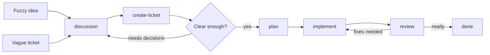

# skills

Personal Claude Code and Codex configurations for the Pane team. Each contributor has their own folder. Start in `parsa/` for one take.

## Why this repo exists

I wrote about our workflow [here](https://runpane.com/blog/a-turing-award-winner-just-described-our-exact-workflow). That post is the pitch. This repo is the implementation, and it has drifted from the post in ways worth naming.

## What changed

The blog frames it as one loop: spec, read, verify. In practice each phase wanted its own tools, its own prompts, and often its own model. The repo grew accordingly.

Spec became three tiers. A typo fix and a migration are not the same kind of thinking, and one prompt cannot serve both without making the small thing slow or the big thing reckless.

Verify stopped meaning tests. Tests only check what you remembered to check. The interesting verification is a fresh agent reading the diff against the docs with no memory of how it got written.

Review became adversarial by default. Same agent reviewing its own output is theater. The reviewers in this repo run with no shared context, and the strongest version runs them across both Claude and Codex. Disagreements between the two are usually exactly where the bugs live.

The fix loop closed. Bugs that get fixed once should not get rewritten next session, so fixes turn into notes, notes turn into skills, and the repo is partly the residue of that.

## Layout

```
parsa/
  .claude/   skills, commands, agents, hooks, settings
  .codex/    skills, config
```

Skills are the atoms. Commands compose them. Agents are who the commands hand off to. Hooks keep any of them from doing something irreversible.

## Using these

Copy `parsa/.claude` and `parsa/.codex` into a project root and read the `SKILL.md` files. They are written to be edited. The shape of the workflow generalizes. The contents should not.

## How we work with LLMs

The basic idea is simple: don't ask an LLM to carry the whole project in its
head.

Use the LLM for one phase at a time:

- talk through uncertainty
- capture intent
- plan the work
- implement the plan
- review from a fresh context

The handoff between phases is the important part. For code, that handoff is
usually a GitHub ticket, plan, PR, or review. For business work, it's the
`.business/` folder.

Most of the time, you're only answering one question:

> Is this clear enough to delegate?

If no, discuss it. If yes, capture it. If it's captured and clear, execute. If
work exists, review it. If review finds a gap, fix it and review again.

### A few common software scenarios

#### I have a fuzzy idea

Start with `discussion`. Once the idea has shape, run `create-ticket`.

```text
discussion -> create-ticket
```

#### I already have a ticket, but it's vague

Use the ticket as the starting point for `discussion`. Then update the ticket so
the next agent doesn't need the whole conversation.

```text
create-ticket -> discussion -> create-ticket
```

#### I have a crisp ticket

Go straight into execution.

```text
create-ticket -> plan -> implement -> review
```

Review loops back to implementation until the work matches the ticket. For
non-trivial changes, use Codex and Claude as independent readers when possible:
one implements, the other reviews, then rerun until the ticket intent, plan,
diff, and runtime behavior agree.

Here's the same software loop as a map:



### Business work is the same shape

For stakeholder-facing work, don't jump straight from conversation to artifact.
The agent needs a context base first, the same way a software agent needs a
repo.

In practice, that means:

```text
context -> discussion -> spec -> artifact -> review -> release
```

The human attention points are still few: the initial captured conversation or
ticket, `business-discussion`, and the final gate when the work is high-stakes
or ready to leave the building.

Here's the business workflow as a map:

```mermaid
flowchart LR
  C[business-context] --> A[business-research-adversary]
  A --> D[business-discussion]
  D --> S[business-spec]
  S --> SR[business-spec-reviewer]
  SR -->|revise| S
  SR -->|approved| ART[business-artifact]
  ART --> AR[business-artifact-reviewer]
  AR -->|fixes needed| ART
  AR -->|approved| REL[business-prepare-release]
  REL --> Gate[human gate / release]
```



## Keeping user-level skills in sync (optional)

Use this if you want the skills in this repo available in every project on your machine.

User-level skill folders:

- Claude Code: `~/.claude/skills/`
- Codex: `~/.codex/skills/`

Create a sync script for Claude Code:

```bash
#!/usr/bin/env bash
set -euo pipefail

REPO="$HOME/path/to/this/repo"
SRC="$REPO/parsa/.claude/skills/"
DEST="$HOME/.claude/skills/"
LOG="$HOME/.claude/skills-sync.log"

mkdir -p "$DEST"
{
  echo "=== $(date -Iseconds) ==="
  git -C "$REPO" pull --ff-only
  rsync -a --human-readable "$SRC" "$DEST"   # no --delete: leaves your other skills alone
  echo "synced ok"
} >>"$LOG" 2>&1
```

`chmod +x ~/.local/bin/sync-claude-skills.sh`

Create the same script for Codex, changing only the paths:

```bash
#!/usr/bin/env bash
set -euo pipefail

REPO="$HOME/path/to/this/repo"
SRC="$REPO/parsa/.codex/skills/"
DEST="$HOME/.codex/skills/"
LOG="$HOME/.codex/skills-sync.log"

mkdir -p "$DEST"
{
  echo "=== $(date -Iseconds) ==="
  git -C "$REPO" pull --ff-only
  rsync -a --human-readable "$SRC" "$DEST"   # no --delete: leaves your other skills alone
  echo "synced ok"
} >>"$LOG" 2>&1
```

`chmod +x ~/.local/bin/sync-codex-skills.sh`

Then run them every 4 hours with `crontab -e`:

```
0 */4 * * * /home/you/.local/bin/sync-claude-skills.sh
5 */4 * * * /home/you/.local/bin/sync-codex-skills.sh
```

This is lightweight: it only does `git pull --ff-only` and `rsync`. There is no `--delete`, so other local skills are left alone.

Cron only runs while your computer is awake. Restart Codex after new skills sync so the active session sees them.
