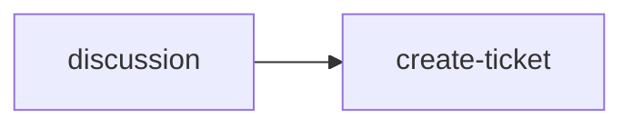
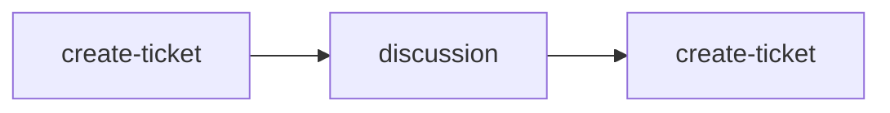
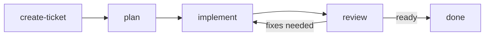

# skills

Personal Claude Code and Codex configurations for the Pane team. Each contributor has their own folder. Start in `parsa/` for one take.

## Why this repo exists

I wrote about our workflow [here](https://runpane.com/blog/a-turing-award-winner-just-described-our-exact-workflow). That post is the pitch. This repo is the implementation, and it has drifted from the post in ways worth naming.

## What changed

The blog frames it as one loop: spec, read, verify. In practice each phase wanted its own tools, its own prompts, and often its own model. The repo grew accordingly.

Spec became three tiers. A typo fix and a migration are not the same kind of thinking, and one prompt cannot serve both without making the small thing slow or the big thing reckless.

Verify stopped meaning tests. Tests only check what you remembered to check. The interesting verification is a fresh agent reading the diff against the docs with no memory of how it got written.

Review became adversarial by default. Same agent reviewing its own output is theater. The reviewers in this repo run with no shared context, and the strongest version runs them across both Claude and Codex. Disagreements between the two are usually exactly where the bugs live.

The fix loop closed. Bugs that get fixed once should not get rewritten next session, so fixes turn into notes, notes turn into skills, and the repo is partly the residue of that.

## Layout

```
parsa/
  .claude/   skills, commands, agents, hooks, settings
  .codex/    skills, config
```

Skills are the atoms. Commands compose them. Agents are who the commands hand off to. Hooks keep any of them from doing something irreversible.

## Using these

Copy `parsa/.claude` and `parsa/.codex` into a project root and read the `SKILL.md` files. They are written to be edited. The shape of the workflow generalizes. The contents should not.

## How we work with LLMs

The job is not to make one agent do everything in one long context. The job is
to keep intent, context, execution, and review as separate surfaces so each pass
can be sharper.

The human should spend attention where judgment matters: shaping the intent,
settling ambiguous decisions, and reading the final gate. Agents should do the
mechanical investigation, drafting, implementation, and adversarial review, with
handoffs written to files or tickets instead of kept only in chat memory.

### Software workflow

Start with discussion when the shape of the work is still fuzzy. Capture the
result in a ticket once the intent is clear enough to delegate.



If a ticket already exists but the decisions are not settled, use the ticket as
the discussion input, then update or replace the ticket once the intent is
clear.



If the ticket is well-scoped and does not require product or architecture
decisions, move into execution.



For non-trivial implementation, review is a loop, not a last checkbox. Use
Codex and Claude as independent readers when possible: one implements, the other
reviews, then swap or rerun until the ticket intent, plan, diff, and runtime
behavior agree.

### Business workflow

Business work follows the same principle, but the handoff surface is a
`.business/` context base instead of a code repo. Serious stakeholder-facing
work should not jump straight from conversation to artifact.


Human attention concentrates in two places: the initial captured
conversation/ticket and `business-discussion`. After that, `business-spec`,
`business-artifact`, and `business-prepare-release` should run with as much
automation as possible, returning to the human only when the review finds a
high-stakes claim, underspecified decision, or release risk.

## Keeping user-level skills in sync (optional)

Use this if you want the skills in this repo available in every project on your machine.

User-level skill folders:

- Claude Code: `~/.claude/skills/`
- Codex: `~/.codex/skills/`

Create a sync script for Claude Code:

```bash
#!/usr/bin/env bash
set -euo pipefail

REPO="$HOME/path/to/this/repo"
SRC="$REPO/parsa/.claude/skills/"
DEST="$HOME/.claude/skills/"
LOG="$HOME/.claude/skills-sync.log"

mkdir -p "$DEST"
{
  echo "=== $(date -Iseconds) ==="
  git -C "$REPO" pull --ff-only
  rsync -a --human-readable "$SRC" "$DEST"   # no --delete: leaves your other skills alone
  echo "synced ok"
} >>"$LOG" 2>&1
```

`chmod +x ~/.local/bin/sync-claude-skills.sh`

Create the same script for Codex, changing only the paths:

```bash
#!/usr/bin/env bash
set -euo pipefail

REPO="$HOME/path/to/this/repo"
SRC="$REPO/parsa/.codex/skills/"
DEST="$HOME/.codex/skills/"
LOG="$HOME/.codex/skills-sync.log"

mkdir -p "$DEST"
{
  echo "=== $(date -Iseconds) ==="
  git -C "$REPO" pull --ff-only
  rsync -a --human-readable "$SRC" "$DEST"   # no --delete: leaves your other skills alone
  echo "synced ok"
} >>"$LOG" 2>&1
```

`chmod +x ~/.local/bin/sync-codex-skills.sh`

Then run them every 4 hours with `crontab -e`:

```
0 */4 * * * /home/you/.local/bin/sync-claude-skills.sh
5 */4 * * * /home/you/.local/bin/sync-codex-skills.sh
```

This is lightweight: it only does `git pull --ff-only` and `rsync`. There is no `--delete`, so other local skills are left alone.

Cron only runs while your computer is awake. Restart Codex after new skills sync so the active session sees them.
