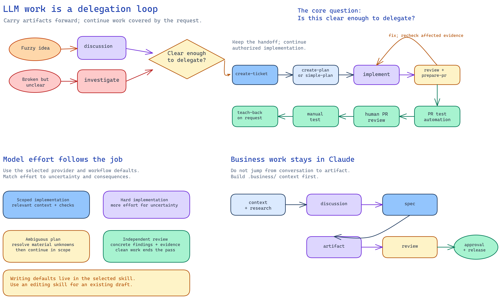
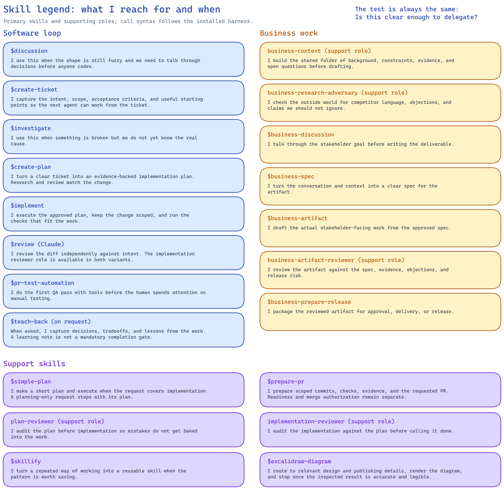
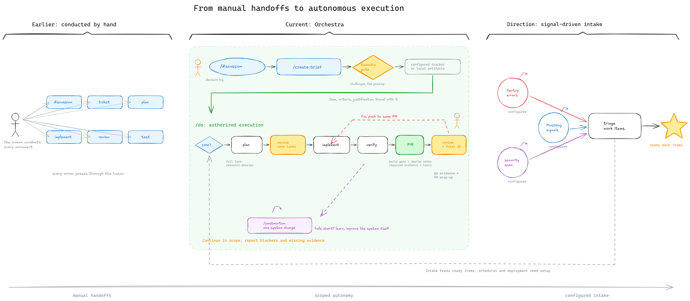
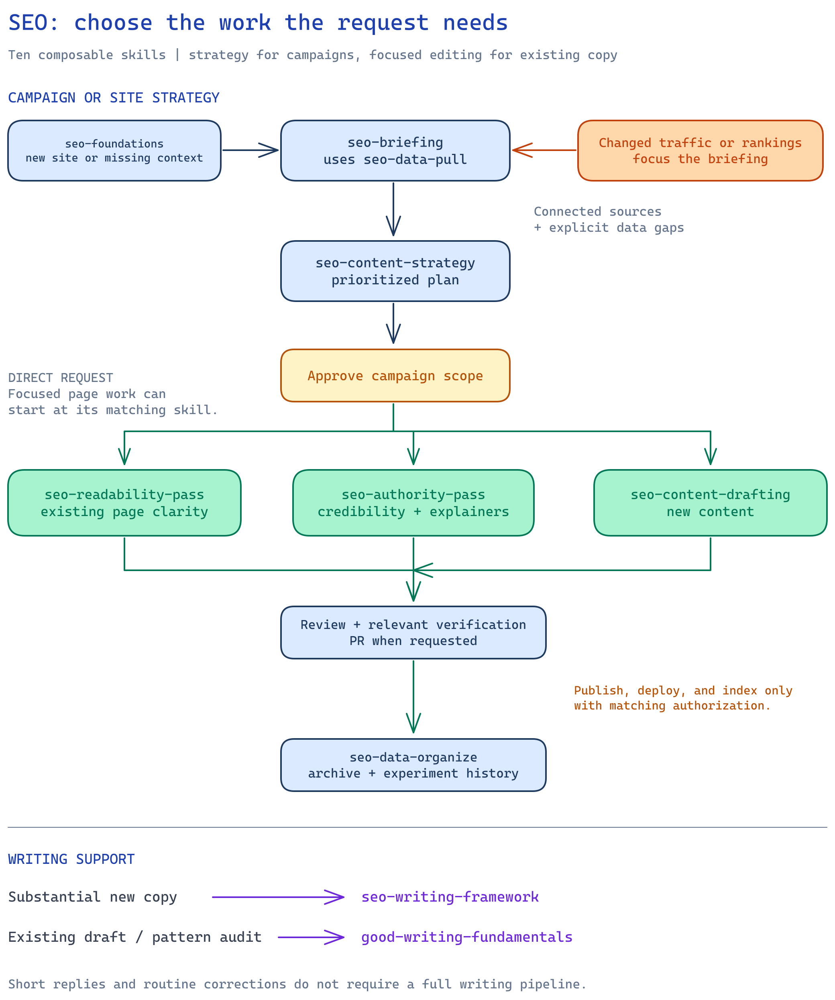

# skills

This repo keeps the LLM workflows we actually use on the Pane team.

The goal is simple: make good work easier to delegate, review, test, and learn
from. These skills help with the moments that repeat: fuzzy ideas, ticket
capture, planning, implementation, review, PR testing, and learning from the
work.

Start in `parsa/` for the current version of the workflow.

Here is the whole workflow as a map:



_Source: [docs/readme-workflow-map.excalidraw](docs/readme-workflow-map.excalidraw)_

And here is the skill legend:



_Source: [docs/readme-skill-legend.excalidraw](docs/readme-skill-legend.excalidraw)_

## The evolution toward a software factory



_Source: [docs/software-factory-story.excalidraw](docs/software-factory-story.excalidraw)_

Parsa's skills are composable stages that can continue through an authorized
implementation request. `runpane-orchestrator` also coordinates workstreams
end to end. Orchestra packages capture, execution, review, and QA into `/do`
and is maintained in [dcouple/orchestra](https://github.com/dcouple/orchestra).
The `tyler/` tree here is a frozen ancestor, retained for historical reference.

The story diagram contrasts earlier manual coordination with today's pipeline
and the direction of further signal-driven intake. It does not promise that
all shown schedules or deployments are enabled. The current Orchestra workflow
is documented in [its WORKFLOW.md](https://github.com/dcouple/orchestra/blob/main/WORKFLOW.md).
The [visual index](docs/README.md) separates current maps from historical
snapshots, including `tyler-workflow-map` and `software-orchestra`.

## How we work with LLMs

Don't ask an LLM to carry the whole project in its head.

Each phase should leave something behind for the next one: a ticket, a plan, a
PR, a review, a test note, or a learning note. For business work, that handoff
lives in `.business/`.

Most of the time, you're only answering one question:

> Is this clear enough to delegate?

If no, **discuss** it. If yes, **capture** it. If it's captured and clear,
**execute**. If work exists, **review** it. If review finds a gap, **fix** it
and rerun the affected review and checks.

### A few common software scenarios

#### I have a fuzzy idea

Start with `discussion`. Once the idea has shape, run `create-ticket`.

```text
discussion -> create-ticket
```

#### I already have a ticket, but it's vague

Use the ticket as the starting point for `discussion`. Then update the ticket so
the next agent doesn't need the whole conversation.

```text
create-ticket -> discussion -> create-ticket
```

#### I have a crisp ticket

Go straight into execution.

```text
create-ticket -> create-plan (or simple-plan) -> implement -> implementation review
-> prepare-pr -> pr-test-automation -> human PR review and remaining manual tests
```

`create-plan`, `implement`, and their reviewers have their own internal checks.
`simple-plan` combines a short plan with execution when that work is authorized.
The standalone `review` skill is available in the Claude variant. You don't
need to think about every reviewer by hand every time; the important thing is
that review loops back to implementation until the work matches the ticket. For
non-trivial changes, use Codex and Claude as independent readers when possible:
one implements, the other reviews, then rerun affected checks after concrete
fixes until intent and behavior agree. A clean review of unchanged work ends that pass.

Once the review loop is clean, run `pr-test-automation` before asking the human
to spend attention in GitHub. This is the first-pass QA sweep: local services,
browser automation, product flows, logs, analytics, webhooks, email/SMS, and
whatever else can be checked from tools. The goal is not to replace human
testing; it's to make the human's pass start from evidence instead of hope.
After that, the human reviews the PR and tests whatever automation could not
prove. `prepare-pr` opens a normal PR only when its readiness conditions pass;
use a draft when requested or when blockers need a visible handoff. A draft
status change is distinct from approval to merge.

When a learning note is requested after completion, run `teach-back`. It explains:
what approach worked, what roads were rejected, what tradeoffs were made, where
the messy parts were, and what lesson transfers to the next project.

If the problem is broken but not understood yet, start with `investigate`
before creating the ticket or plan.

#### I want an agent to manage many issues end to end

Use `runpane-orchestrator`. It is the higher-level loop for asking an agent to
fan out GitHub issues into persistent Pane workstreams and proactively advance
already-authorized reversible stages through current-head review, PR, QA, and CI.

```text
investigate -> create-plan or simple-plan -> implement -> implementation review
-> prepare-pr -> review feedback -> PR QA -> current CI and evidence -> ready to merge
```

The orchestrator remembers stage and external-mutation grants, monitors parallel
workstreams, and does not ask again for covered reversible progress. Merge,
deploy, release, version/publish, production/destructive action, and scope
expansion remain exact-authorization hard stops.

The skill exists in both Parsa variants:

- Codex: `parsa/.codex/skills/runpane-orchestrator/`
- Claude Code: `parsa/.claude/skills/runpane-orchestrator/`

#### I want Pane Chat to remember or prioritize my work

Use `pane-work-recap` when you ask what happened recently: active panes,
archived panes, branches, PRs, and agent logs.

Use `pane-work-prioritizer` when you ask what to work on next: active panes,
recent repos, GitHub review requests, open PRs, assigned issues, checks, labels,
and review findings.

These are read-only Pane Chat workflows. The shared, agent-agnostic overview
lives at `parsa/pane-chat/work-questions.md`; the Codex and Claude skill
folders provide agent-specific discovery metadata and detailed instructions.

### Model choice

Use the model and harness selected by the user or configured in the workflow.
Match effort and review independence to the uncertainty and consequences of the
change. Role instructions describe evidence and completion requirements rather
than assuming one model needs repeated supervision. Preserve explicit provider
choices; report an unavailable requested provider instead of silently switching.
The business and SEO workflows keep their documented writing-provider defaults.

### Business work

For stakeholder-facing work, build context before drafting. The `.business/`
folder is the handoff. Use Claude for this workflow. Codex is excellent raw
engineering power, especially when speed matters on hard implementation work,
but it is not the right default for business writing, positioning, or public
copy.

In practice, that means:

```text
context -> discussion -> spec -> artifact -> review -> release
```

The human attention points are still few: the initial conversation or ticket,
`business-discussion`, and the final gate when the work is high-stakes or ready
to leave the building.

### SEO work

For website content, SEO, and E-E-A-T, use the SEO skill suite. Data first,
strategy second, execution third. Use Claude Opus 4.6 for all copy work.



_Source: [docs/seo-workflow-map.excalidraw](docs/seo-workflow-map.excalidraw)_

In practice, that means:

```text
seo-briefing -> seo-content-strategy -> seo-readability-pass / seo-authority-pass / seo-content-drafting
```

The skills are in three buckets: proactive (monitoring + strategy), foundational
(readability + authority passes, run anytime), and execution (new content
drafting). See `parsa/seo/` for the full README.

For substantial copy, `seo-writing-framework` provides research, drafting,
reader review, editing, and quality gates. `good-writing-fundamentals` is its
line-editing layer, adapted from
[petergyang/no-ai-slop](https://github.com/petergyang/no-ai-slop) (MIT).
An existing draft or a short reply can use the relevant editing skill without
starting a full content-development cycle.

### Writing skill selection

Use `rewrite-simply` for the structure and brevity of an existing draft,
`good-writing-fundamentals` for line editing or AI-pattern detection, and
`seo-writing-framework` for substantial content creation that needs research
and editorial development. Short replies and routine corrections do not need
all three. The two `rewrite-simply` variants stay identical and apply to the
requested draft, not every later message.

`rewrite-simply` retains adapted material from
[alexgreensh/attention-span](https://github.com/alexgreensh/attention-span)
(AGPL-3.0, LICENSE included), the doozy communication and deliverable-writing
prompts (with product-specific rules removed), and our phrasing of Zinsser's
clutter and clarity principles. The local workflow and cutting guidance are
adapted; they are not a verbatim upstream copy.

The skill directory is AGPL-3.0 by way of attention-span. It is an independent
work aggregated alongside the rest of this repo, which is unaffected. doozy is
private and this repo is public, so its text is here on purpose, with its
product-specific rules left out: the lowercase house voice, artifact and
approval-form handling, and integration naming.

## What is in this repo

Each contributor has their own folder. Start with `parsa/`.

```text
parsa/
  .claude/     Claude Code skills, commands, agents, hooks, settings
  .codex/      Codex skills and config
  pane-chat/   Shared Pane Chat workflow references
  business/    Business agent skills (context, discussion, spec, artifact, release)
  seo/         SEO skills (briefing, strategy, readability, authority, drafting)
tyler/
  .claude/     Claude Code skills and agents (Claude orchestrates)
  .codex/      Codex role skills, dispatched from Claude via codex exec
  references/  Single-copy shared docs (output formats, criteria) both harnesses read
```

`tyler/` documents its historical pipeline in [tyler/README.md](tyler/README.md).
Its old capture commands and routing are not the current Orchestra interface.
Edit active workflows in `parsa/`; make Orchestra changes in its canonical repo.

## Keeping skills in sync

For a combined current installation, use an Orchestra checkout and this repo:

```bash
bash /path/to/orchestra/scripts/sync-user.sh
bash /path/to/skills/sync-parsa-overlay.sh /path/to/orchestra
```

The [overlay script](sync-parsa-overlay.sh) installs Parsa's Claude and Codex
skills plus Claude agents, business skills, and SEO skills. Names owned by
Orchestra become `p-<name>` in Parsa's installed set, and `create-plan` is
rewritten to call Parsa's preserved plan reviewer. The equivalent Excalidraw
skill uses Orchestra's copy where the names overlap. Personal skills remain.
Later Orchestra and overlay syncs can run in either order without overwriting
each other's canonical names. Restart the harness or refresh discovery to load
newly installed skills.

To automate updates, export `origin/main` from both repos and run these scripts
from the exports, passing the Orchestra export path to the overlay. Use `bash`
and the combined flow above. A one-set copy on a timer can overwrite colliding
names. Run installation only for the intended user account and authorized scope.

For a Parsa-only installation, copy the desired skill folders from
`parsa/.claude/skills/` or `parsa/.codex/skills/` into the matching harness's
skill directory and include the agents or supporting folders they reference.
The combined installer is preferable when both sets are needed.

`sync-merged.sh` is a **legacy installer** for this repo's Parsa and frozen
Tyler trees. It does not install current Orchestra. Its historical behavior
is retained for existing users; use the current combined flow above for new
installations.

## Background

This grew out of the workflow described
[here](https://runpane.com/blog/a-turing-award-winner-just-described-our-exact-workflow).
The original frame was spec, read, verify. In practice, we split that into
smaller steps because each moment needs different behavior: discussion, ticket
capture, planning, implementation, review, PR testing, and teach-back.

## Workflow instruction contracts

`simple-plan` handles a short local plan and execution; `create-plan` produces a
larger handoff contract; `implement` owns integration and review; `prepare-pr`
finishes scoped commits, checks, and the PR. An already-authorized end-to-end
request continues across these stages. A planning-only request returns its plan.
All workflows retain their explicit merge, publishing, and production boundaries.

Long QA, diagram, and orchestration details are linked from their entrypoints
and loaded for the current operation. `runpane-orchestrator` retains the full
conjunctive `ready_to_merge` gate; passing an early stage is not PR readiness.
