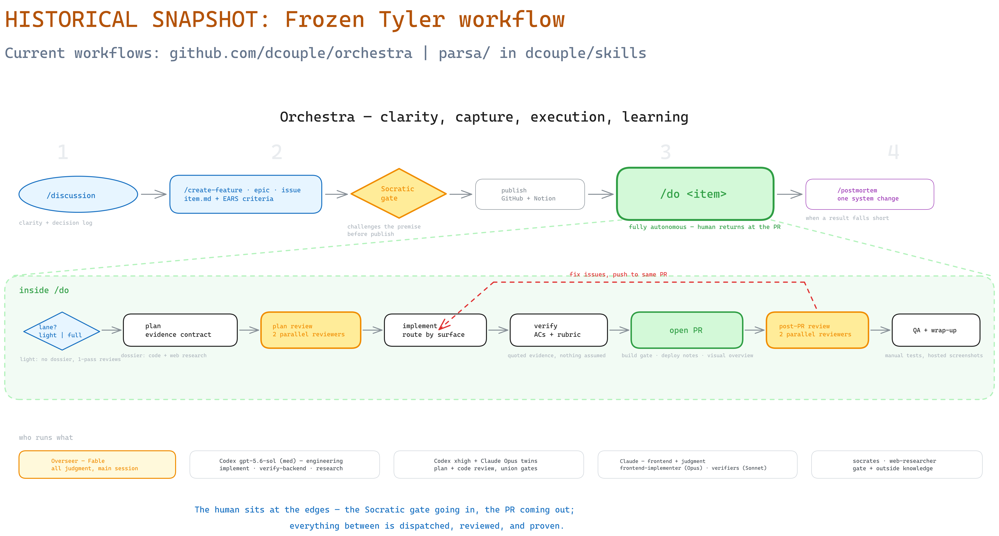

# skills

This repo keeps the LLM workflows we actually use on the Pane team.

The goal is simple: make good work easier to delegate, review, test, and learn
from. These skills help with the moments that repeat: fuzzy ideas, ticket
capture, planning, implementation, review, PR testing, and learning from the
work.

Start in `parsa/` for the current version of the workflow.

Here is the whole workflow as a map:


_Source: [docs/readme-workflow-map.excalidraw](docs/readme-workflow-map.excalidraw)_

And here is the skill legend:


_Source: [docs/readme-skill-legend.excalidraw](docs/readme-skill-legend.excalidraw)_

## The evolution — toward a software factory


_Source: [docs/software-factory-story.excalidraw](docs/software-factory-story.excalidraw)_

The `parsa/` workflow above is generation one: a human conducts every phase,
and each skill hardens one step — evidence-disciplined planning, independent
review lanes, first-pass QA, learning notes. `tyler/` ("Orchestra") is the
evolution: the same principles compiled into an autonomous pipeline. Capture
passes an adversarial Socratic gate, execution runs end to end on a remote
seat, review and QA self-correct on the open PR, and the human sits at the
edges — the gate going in, the PR coming out. The two sets now share their
strongest parts (evidence contracts, hosted PR visuals, external
verification). Orchestra has since graduated to its own home —
[dcouple/orchestra](https://github.com/dcouple/orchestra) — which is now the
canonical source for that set; the `tyler/` tree here is its frozen ancestor.
To run both sets on one machine: orchestra's `scripts/sync-user.sh`, then
this repo's `./sync-parsa-overlay.sh`.



_Source: [docs/tyler-workflow-map.excalidraw](docs/tyler-workflow-map.excalidraw)_

## How we work with LLMs

Don't ask an LLM to carry the whole project in its head.

Each phase should leave something behind for the next one: a ticket, a plan, a
PR, a review, a test note, or a learning note. For business work, that handoff
lives in `.business/`.

Most of the time, you're only answering one question:

> Is this clear enough to delegate?

If no, **discuss** it. If yes, **capture** it. If it's captured and clear,
**execute**. If work exists, **review** it. If review finds a gap, **fix** it
and rerun the affected review and checks.

### A few common software scenarios

#### I have a fuzzy idea

Start with `discussion`. Once the idea has shape, run `create-ticket`.

```text
discussion -> create-ticket
```

#### I already have a ticket, but it's vague

Use the ticket as the starting point for `discussion`. Then update the ticket so
the next agent doesn't need the whole conversation.

```text
create-ticket -> discussion -> create-ticket
```

#### I have a crisp ticket

Go straight into execution.

```text
create-ticket -> plan -> implement -> review -> pr-test-automation -> human PR review -> manual test -> teach-back
```

`plan`, `implement`, and `review` have their own internal checks. You don't
need to think about every reviewer by hand every time; the important thing is
that review loops back to implementation until the work matches the ticket. For
non-trivial changes, use Codex and Claude as independent readers when possible:
one implements, the other reviews, then rerun affected checks after concrete
fixes until intent and behavior agree. A clean review of unchanged work ends that pass.

Once the review loop is clean, run `pr-test-automation` before asking the human
to spend attention in GitHub. This is the first-pass QA sweep: local services,
browser automation, product flows, logs, analytics, webhooks, email/SMS, and
whatever else can be checked from tools. The goal is not to replace human
testing; it's to make the human's pass start from evidence instead of hope.
After that, the human still reviews the PR file-by-file in GitHub, clicks into
each changed file, and marks the draft ready if the diff looks right. Then the
human manually tests whatever the automation couldn't confidently prove.

When a learning note is requested after completion, run `teach-back`. It explains:
what approach worked, what roads were rejected, what tradeoffs were made, where
the messy parts were, and what lesson transfers to the next project.

If the problem is broken but not understood yet, start with `investigate`
before creating the ticket or plan.

#### I want an agent to manage many issues end to end

Use `runpane-orchestrator`. It is the higher-level loop for asking an agent to
fan out GitHub issues into persistent Pane workstreams and proactively advance
already-authorized reversible stages through current-head review, PR, QA, and CI.

```text
investigate -> plan/create-plan|simple-plan -> implement -> implementation review -> prepare-pr -> address review feedback -> PR test automation -> CI/re-review -> ready to merge
```

The orchestrator remembers stage and external-mutation grants, monitors parallel
workstreams, and does not ask again for covered reversible progress. Merge,
deploy, release, version/publish, production/destructive action, and scope
expansion remain exact-authorization hard stops.

The skill exists in both Parsa variants:

- Codex: `parsa/.codex/skills/runpane-orchestrator/`
- Claude Code: `parsa/.claude/skills/runpane-orchestrator/`

#### I want Pane Chat to remember or prioritize my work

Use `pane-work-recap` when you ask what happened recently: active panes,
archived panes, branches, PRs, and agent logs.

Use `pane-work-prioritizer` when you ask what to work on next: active panes,
recent repos, GitHub review requests, open PRs, assigned issues, checks, labels,
and review findings.

These are read-only Pane Chat workflows. The shared, agent-agnostic overview
lives at `parsa/pane-chat/work-questions.md`; the Codex and Claude skill
folders provide agent-specific discovery metadata and detailed instructions.

### Model choice

Use the model and harness selected by the user or configured in the workflow.
Match effort and review independence to the uncertainty and consequences of the
change. Role instructions describe evidence and completion requirements rather
than assuming one model needs repeated supervision. Preserve explicit provider
choices; report an unavailable requested provider instead of silently switching.
The business and SEO workflows keep their documented writing-provider defaults.

### Business work

For stakeholder-facing work, build context before drafting. The `.business/`
folder is the handoff. Use Claude for this workflow. Codex is excellent raw
engineering power, especially when speed matters on hard implementation work,
but it is not the right default for business writing, positioning, or public
copy.

In practice, that means:

```text
context -> discussion -> spec -> artifact -> review -> release
```

The human attention points are still few: the initial conversation or ticket,
`business-discussion`, and the final gate when the work is high-stakes or ready
to leave the building.

### SEO work

For website content, SEO, and E-E-A-T, use the SEO skill suite. Data first,
strategy second, execution third. Use Claude Opus 4.6 for all copy work.


_Source: [docs/seo-workflow-map.excalidraw](docs/seo-workflow-map.excalidraw)_

In practice, that means:

```text
seo-briefing -> seo-content-strategy -> seo-readability-pass / seo-authority-pass / seo-content-drafting
```

The skills are in three buckets: proactive (monitoring + strategy), foundational
(readability + authority passes, run anytime), and execution (new content
drafting). See `parsa/seo/` for the full README.

Every copy skill runs through `seo-writing-framework`: research, draft, reader
hat, edit, slop gate, score. The gate is `good-writing-fundamentals`, adapted
from [petergyang/no-ai-slop](https://github.com/petergyang/no-ai-slop) (MIT).

That one is worth reaching for outside SEO too. It holds the line-level rules
for any prose a person will read, including PR descriptions and release notes:
active voice, concrete detail, direct verbs, and the AI patterns that survive a
normal edit because they're grammatical and confident. Paste a draft to get it
edited, or ask whether it reads as AI to get each pattern quoted back with a
fix. If the piece doesn't exist yet and it's customer-facing, it points you at
the framework first.

### Writing skill selection

Use `rewrite-simply` for the structure and brevity of an existing draft,
`good-writing-fundamentals` for line editing or AI-pattern detection, and
`seo-writing-framework` for substantial content creation that needs research
and editorial development. Short replies and routine corrections do not need
all three. The two `rewrite-simply` variants stay identical and apply to the
requested draft, not every later message.

`rewrite-simply` retains adapted material from
[alexgreensh/attention-span](https://github.com/alexgreensh/attention-span)
(AGPL-3.0, LICENSE included), the doozy communication and deliverable-writing
prompts (with product-specific rules removed), and our phrasing of Zinsser's
clutter and clarity principles. The local workflow and cutting guidance are
adapted; they are not a verbatim upstream copy.

The skill directory is AGPL-3.0 by way of attention-span. It is an independent
work aggregated alongside the rest of this repo, which is unaffected. doozy is
private and this repo is public, so its text is here on purpose, with its
product-specific rules left out: the lowercase house voice, artifact and
approval-form handling, and integration naming.

## What is in this repo

Each contributor has their own folder. Start with `parsa/`.

```text
parsa/
  .claude/     Claude Code skills, commands, agents, hooks, settings
  .codex/      Codex skills and config
  pane-chat/   Shared Pane Chat workflow references
  business/    Business agent skills (context, discussion, spec, artifact, release)
  seo/         SEO skills (briefing, strategy, readability, authority, drafting)
tyler/
  .claude/     Claude Code skills and agents (Claude orchestrates)
  .codex/      Codex role skills, dispatched from Claude via codex exec
  references/  Single-copy shared docs (output formats, criteria) both harnesses read
```

Tyler's variant is a six-skill pipeline (`/discussion` → `/create-feature` /
`/create-epic` / `/create-issue` → `/do` → `/postmortem`) where Claude
orchestrates and Codex runs implementation, review, codebase research, and
investigation — see `tyler/README.md`.

The skills are meant to be edited. The workflow shape should generalize, but the
exact contents should change as your work changes.

## Keeping skills in sync

Use this repo directly in a project, or copy the skills into your user-level
folders:

- Claude Code: `~/.claude/skills/`
- Codex: `~/.codex/skills/`

> **Post-split note:** tyler's set now lives in
> [dcouple/orchestra](https://github.com/dcouple/orchestra) (see its
> `scripts/sync-user.sh` for the user-level install). To run both sets on one
> machine, run that first, then `./sync-parsa-overlay.sh <orchestra-checkout>`
> from this repo — it installs parsa's set, turning any name orchestra owns
> into `p-<name>` so the two syncs never clobber each other, in any order.
> `sync-merged.sh` below predates the split and only covers this repo's copy
> of both sets.

**Use `./sync-merged.sh` — it's the whole setup in one command.** It installs
parsa's AND tyler's sets side by side (tyler's names win the few collisions;
parsa's originals are preserved under a `p-` prefix, and his skills are
re-wired to keep using them). It's idempotent and safe to re-run.

```bash
REPO="$HOME/allGitHubRepos/skills"
git -C "$REPO" pull --ff-only
"$REPO"/sync-merged.sh
```

To keep it fresh automatically, run it on a schedule. On macOS, a launchd
agent that exports `origin/main` and runs the script every 30 minutes:

```bash
# ~/bin/sync-dcouple-skills.sh
#!/bin/sh
set -eu
REPO="$HOME/allGitHubRepos/skills"
git -C "$REPO" fetch origin main
TMP=$(mktemp -d); trap 'rm -rf "$TMP"' EXIT
git -C "$REPO" archive origin/main | tar -x -C "$TMP"
bash "$TMP/sync-merged.sh"
```

Point a LaunchAgent (`StartInterval` 1800) or cron at that wrapper. Exporting
`origin/main` means the sync never depends on what branch your checkout is on.
Two warnings from experience: invoke the script with `bash` (it uses process
substitution; `sh` silently skips the collision handling), and don't schedule
the per-set rsync blocks below — a parsa-only sync running on a timer will
silently clobber the merged arrangement every tick.

### One set only (legacy)

If you truly want just parsa's set, the per-set shape is:

```bash
REPO="$HOME/allGitHubRepos/skills"
git -C "$REPO" pull --ff-only

# Claude Code skills
rsync -a "$REPO/parsa/.claude/skills/" "$HOME/.claude/skills/"

# Codex skills
rsync -a "$REPO/parsa/.codex/skills/" "$HOME/.codex/skills/"

# Business skills (Claude + Codex)
for skill in "$REPO"/parsa/business/*/; do
  [ -f "$skill/SKILL.md" ] && cp -r "$skill" "$HOME/.claude/skills/$(basename "$skill")"
done

# SEO skills (Claude)
for skill in "$REPO"/parsa/seo/*/; do
  [ -f "$skill/SKILL.md" ] && cp -r "$skill" "$HOME/.claude/skills/$(basename "$skill")"
done
```

### Both sets at once (merged sync)

This is the default documented above — `./sync-merged.sh` instead
of the per-set blocks. It installs both sets; where names collide (currently
`discussion`, the `plan-reviewer` agent, and two Codex role skills), tyler's
version keeps the canonical name — his `/discussion` → `/create-*` → `/do`
pipeline stays the default — and parsa's original is preserved under a `p-`
prefix (`/p-discussion`, `p-plan-reviewer`, …). Collisions are detected
dynamically, and parsa's `create-plan` is re-wired to spawn `p-plan-reviewer`
so his planning loop keeps using his own reviewer. Inside this repo neither
sync matters: the harness namespaces both sets automatically
(`parsa:discussion`, `tyler:discussion`).

Do not use `--delete` unless you want this repo to remove other local skills.
Restart Codex after new skills sync so the active session can see them.

## Background

This grew out of the workflow described
[here](https://runpane.com/blog/a-turing-award-winner-just-described-our-exact-workflow).
The original frame was spec, read, verify. In practice, we split that into
smaller steps because each moment needs different behavior: discussion, ticket
capture, planning, implementation, review, PR testing, and teach-back.

## Workflow instruction contracts

`simple-plan` handles a short local plan and execution; `create-plan` produces a
larger handoff contract; `implement` owns integration and review; `prepare-pr`
finishes scoped commits, checks, and the PR. An already-authorized end-to-end
request continues across these stages. A planning-only request returns its plan.
All workflows retain their explicit merge, publishing, and production boundaries.

Long QA, diagram, and orchestration details are linked from their entrypoints
and loaded for the current operation. `runpane-orchestrator` retains the full
conjunctive `ready_to_merge` gate; passing an early stage is not PR readiness.
