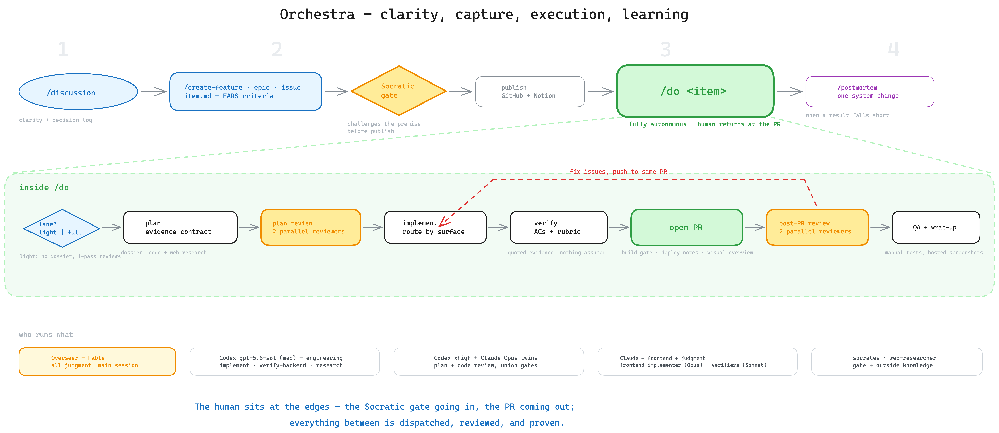

# tyler

A dual-harness development workflow (codenamed "Orchestra" in the build plan —
that name stays out of the runtime files so every dispatched model gets plain
definitions). Claude Code is the orchestrating harness: Fable makes the
judgment calls and dispatches sub-agents; Codex (GPT-5.6) runs the
engineering-heavy roles.

The whole system at a glance:



_Source: [docs/tyler-workflow-map.excalidraw](../docs/tyler-workflow-map.excalidraw)_

## The workflow

The flow separates *clarity*, *capture*, and *execution*:

1. **`/discussion`** — clarify, understand, figure out. General-purpose: it
   dispatches the code-researcher / `web-researcher` for questions and the
   investigator (with `frontend-verifier` for reproduction) when the topic is a
   defect. It produces clarity plus a dated decision log
   (`./tmp/discussions/`) that the `/create-*` drafting step reads — never
   deliverables.
2. **`/create-feature` · `/create-epic` · `/create-issue`** — manually invoked
   capture skills. Each turns what the conversation established into a lean
   work item at `./tmp/<id>/item.md` (Feature Ticket, Epic Spec, or Bug
   Report, raw sources in `./tmp/<id>/refs/`) with verification criteria,
   then **publishes** it: a GitHub issue in the project repo
   plus a Notion work item (via the `notion` skill) holding `item.md` and
   every artifact, cross-linked both ways. `/create-issue` runs the
   investigator itself if the root cause isn't already established. Before
   publish, every draft passes the **Socratic gate**: the `socrates`
   sub-agent takes an adversarial position on the item's premise (needed at
   all? root cause or symptom? simpler path? right shape? the whole of it?)
   and the user's answers — distilled into the item's `## Justification`
   section — travel with the GitHub issue. Intensity scales with the item:
   straightforward drafts fast-pass with 0–2 questions; epics always get the
   full challenge.
3. **`/do <issue # or item path>`** — the autonomous pipeline: pull the work
   item's artifacts from Notion into `./tmp/<id>/` (when given a GitHub
   issue) → lane call (light/full) → plan + review loop (full lane backed by
   a research dossier, every plan under the evidence contract) → implement →
   verify → build gate + deploy-notes scan + PR → post-PR review loop + QA
   pass over the PR's manual tests → wrap-up, with `plan.md`/`wrapup.md`
   uploaded back to the Notion work item at the end. Deliberately high-level:
   the Overseer judges the lane, how much research a plan needs, and when
   each review loop has converged.
4. **`/postmortem`** — when a result falls short, root-cause it in *our
   system* (skill/agent/template), not just the code.

This table is the single source of truth for model routing — the guides and
skills point here; update it first when routing changes, and update `/do`'s
**Sub-agents** paragraph in the same commit: this README is not synced to
`~`, so the skills' restatement is what actually executes.

| Role | Runs on | Notes |
| --- | --- | --- |
| Overseer (conducts `/do`, all judgment) | main session — Fable | |
| Web research | Claude `web-researcher` — Sonnet | |
| Verify frontend (drive the running app) | Claude `frontend-verifier` — Sonnet | also reproduces failures for /discussion & /create-issue |
| Verify backend (tests/scripts) | **Codex** GPT-5.6 `medium`, workspace-write | |
| Explore codebase | **Codex** GPT-5.6 `medium`, read-only | Claude `code-researcher` (Sonnet) as backup |
| Reproduce & root-cause | **Codex** GPT-5.6 `xhigh`, workspace-write | |
| Write the diff — backend/ops | **Codex** GPT-5.6 `medium`, workspace-write | |
| Write the diff — frontend web/mobile (UI, styling, client state, user-facing copy) | Claude `frontend-implementer` — Opus | never routed through Codex |
| Challenge the draft work item (Socratic gate) | Claude `socrates` — Opus | always invoked by all three `/create-*`; self-calibrates — fast-passes straightforward drafts, full challenge for epics/unargued items |
| Review the plan | **two parallel reviewers**: Codex GPT-5.6 `xhigh` + Claude `plan-reviewer` (Opus) | Must-Fix gate = union of both |
| Review the diff + security | **two parallel reviewers**: Codex GPT-5.6 `xhigh` + Claude `code-reviewer` (Opus) | Must-Fix gate = union of both |

Every Codex role is dispatched by the **`codex` skill**
(`.claude/skills/codex/`), the one place that knows the `codex exec`
mechanics per role — model, effort, sandbox (reviewers/researchers read-only
+ ephemeral; implementer workspace-write with `resume --last` across fix
rounds; investigator and backend-verifier workspace-write for running tests,
edits forbidden by their role instructions), output capture, and status-line
parsing.

Review loops exit when **no Must Fix remains from either reviewer** — the
Overseer judges when a loop has converged and flags anything left
unresolved in the wrap-up. High effort is for judgment-heavy roles (review,
investigation); implementation and exploration run at medium. Frontend code
and customer-facing copy never route through Codex — they're the
`frontend-implementer`'s lane. `/do` and the three `/create-*` skills
are user-invoked only (`disable-model-invocation`) — the model never fires
them on its own.

Build tracker and design decisions: `../tmp/plan/build-plan.md` (local
working notes — `tmp/` is untracked).

## Where formats live (single copy each — no duplicates to drift)

- **`tyler/references/`** (synced to `~/.references/` — harness-neutral,
  sibling of `~/.claude` and `~/.codex`) — anything referenced by more than
  one skill, or by any agent: the shared blocks (`verification-criteria.md`,
  `verification-methods.md`, `rubrics/` — per-surface verification rubrics,
  `code-quality.md` — the reviewers' house-rules rubric, `qa-verification.md`
  — the QA pass's external-evidence discipline, `system-analysis.md`,
  `publish-work-item.md`, `draft-work-item.md`,
  `socratic-gate.md`) and every agent's output format
  (`references/agents/<agent>/…`). Agents are flat `.md` files by design
  (Claude Code has no agent-folder format), so each agent's body carries a
  pointer — "Read `~/.references/agents/<name>/<format>.md`" — plus a few
  non-negotiable lines as a safety net if the file is missing.
- **`.claude/skills/<name>/references/`** — document formats produced by
  exactly one skill (feature-ticket, epic-spec, bug-report,
  implementation-plan, wrap-up-report, postmortem).
- `../tmp/templates/README.md` (local working notes, untracked) is the index
  mapping every format to its live home.

The six workflow skills above, plus three infrastructure skills the others
invoke — `codex` (dispatches Codex roles), `notion` (the GitHub ↔ Notion
artifact bridge), and `excalidraw-pr-diagrams` (the PR visual-overview
standard `/do`'s PR step uses; kept materially equivalent to parsa's
copies) — are the whole surface. Web research is the
`web-researcher` sub-agent, review lives inside `/do` (plan review before
implement, code review + QA after the PR opens), and all commit/PR prep
lives in `/do`'s PR step.

## Project templates

`templates/` holds copyable per-project scaffolding: `AGENTS.md` (universal
agent instructions both harnesses read) and `CLAUDE.md` (points to AGENTS.md,
adds Claude-only notes, and carries the optional `Work-item tracking`
overrides — the Notion work-items database default lives in the notion
skill's `config.yaml`; a project sets `notion_data_source` only to publish
somewhere different). Copy both into a codebase root and fill in the
sections.

## Keeping in sync

```bash
git -C "$REPO" pull --ff-only
rsync -a "$REPO/tyler/.claude/skills/" "$HOME/.claude/skills/"
rsync -a "$REPO/tyler/.claude/agents/" "$HOME/.claude/agents/"
rsync -a "$REPO/tyler/references/" "$HOME/.references/"
rsync -a "$REPO/tyler/.codex/skills/" "$HOME/.codex/skills/"

# drift check — any output means a local copy differs from the repo
diff -rq "$REPO/tyler/.claude/skills" "$HOME/.claude/skills"
diff -rq "$REPO/tyler/.claude/agents" "$HOME/.claude/agents"
diff -rq "$REPO/tyler/references"     "$HOME/.references"
diff -rq "$REPO/tyler/.codex/skills"  "$HOME/.codex/skills"
```

The `.codex/skills/` role skills (implementer, backend-verifier,
plan-reviewer, code-reviewer, code-researcher, investigator) are thin
pointers — one copy of each document across both harnesses. Role
instructions live in `~/.references/agents/<role>/instructions.md` for the
Codex-only roles (implementer, investigator, backend-verifier) and in
`~/.claude/agents/<name>.md` where a Claude twin exists (code-researcher,
the reviewers); output formats live in `~/.references/agents/<role>/`.

`rsync` without `--delete` won't remove skills/agents that were deleted from
this repo — the drift check's `Only in $HOME/...` lines are the prune list;
remove those by hand (or pass `--delete` if nothing hand-made lives in your
local folders).
